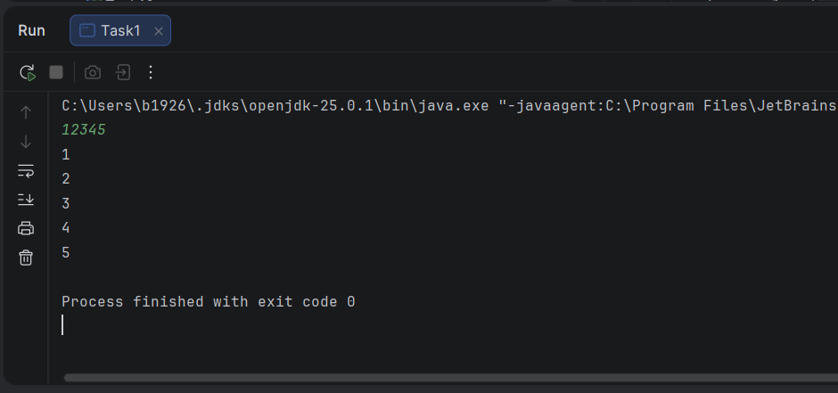
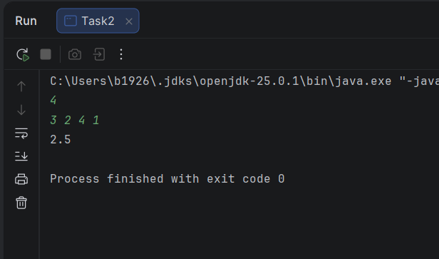
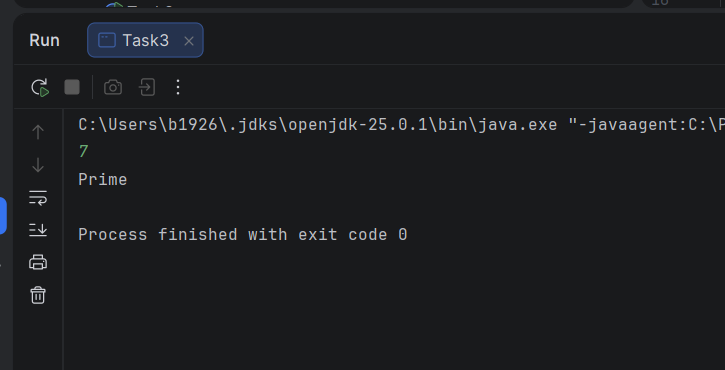
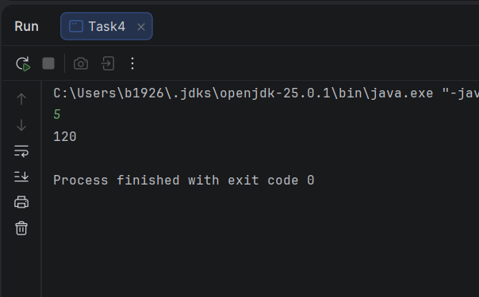
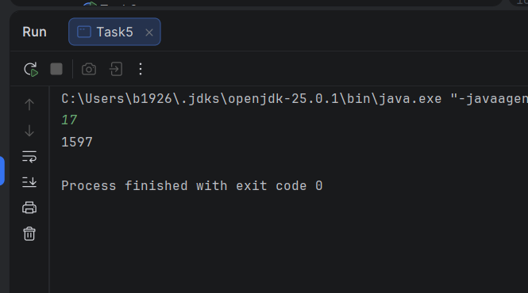
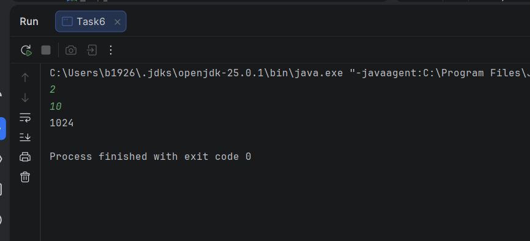
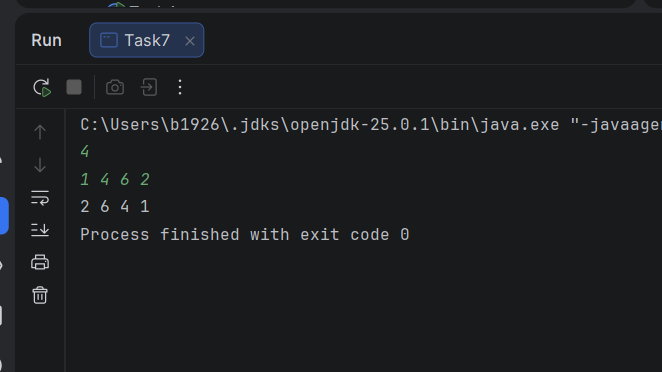
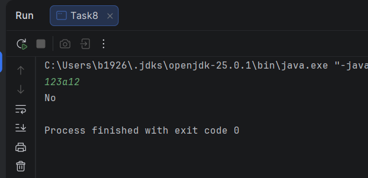
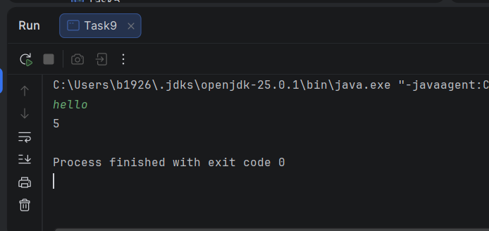
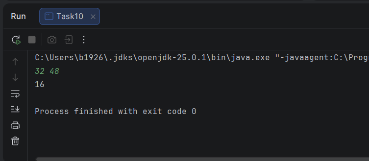

## Assignment 1

Name: Baizakov Darkhan Ashatovich

Group: SE-2511

In this assignment, I solved 10 tasks using recursion in Java.  
All solutions were implemented without loops (`for`, `while`, `do-while`) as required.  
The project was created in IntelliJ IDEA.  
Each task is placed in a separate Java class.

## Task 1 – Print Digits of a Number

This task prints each digit of a number on a separate line using recursion.

## Task 2 – Average of Elements
This task recursively calculates the sum of array elements and then finds the average.

## Task 3 – Prime Number Check
This task checks recursively whether a number is prime or composite.

## Task 4 – Factorial
This task calculates the factorial of a number using recursion.

## Task 5 – Fibonacci Number
This task finds the n-th Fibonacci number recursively.

## Task 6 – Power Function
This task calculates \(a^n\) using recursion.

## Task 7 – Reverse Output
This task reads numbers and prints them in reverse order using recursion without another array.

## Task 8 – Check Digits in String
This task checks recursively whether a string contains only digits.

 

## Task 9 – Count Characters in a String
This task recursively counts the number of characters in a string.

## Task 10 – Greatest Common Divisor
This task finds the greatest common divisor of two numbers using the Euclidean algorithm recursively.

